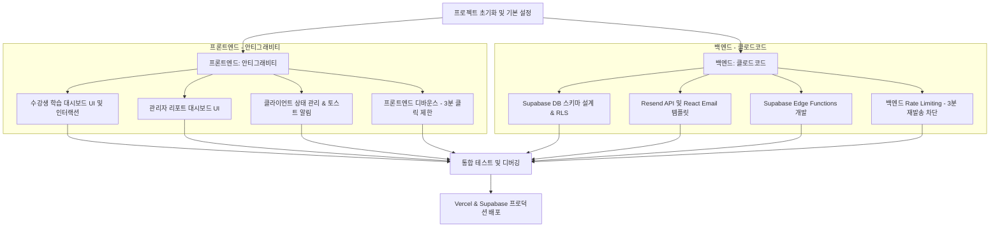

# 📋 Vibe Mailer (바이브 메일러) 병렬 개발 구현 계획서

이 문서는 **Vibe Mailer(바이브 메일러)** 프로젝트를 성공적으로 완수하기 위해, 프론트엔드 개발(안티그래비티)과 백엔드 개발(클로드코드)의 역할을 나누고 병렬로 진행할 수 있도록 작성된 구체적인 개발 계획서입니다.

---

## 🎯 프로젝트 목표 (Goals)
* **프론트엔드:** Next.js (App Router) + Tailwind CSS 기반의 세련되고 반응형을 고려한 수강생용 & 어드민용 대시보드 구축.
* **백엔드:** Supabase Auth/DB, Edge Functions, Resend API를 연동하여 실시간 및 5분 예약 메일 발송 파이프라인 구축.
* **통합 & 배포:** Vercel(프론트엔드 & Next.js API) 및 Supabase(데이터베이스 & Edge Functions) 프로덕션 배포.

---

## 👥 역할 분담 및 병렬 작업 영역



### 1. 프론트엔드 (담당: 안티그래비티)
* **수강생용 학습 대시보드 (`/dashboard`)**
  * 로그인한 수강생 정보 표시 및 로그아웃 기능.
  * 3가지 상태 버튼 UI (Vivid Violet, Neon Green 등 테마 활용, 호버 및 클릭 마이크로 애니메이션 적용).
  * 이모지 사용을 배제하고 라인 아이콘 중심의 깔끔한 디자인 적용.
  * 하단 이메일 발송 이력 알림 피드.
* **관리자용 리포트 대시보드 (`/admin`)**
  * 좌측 사이드바 메뉴 및 상단 4가지 KPI 요약 카드.
  * 수강생 목록 표 (반응형 데이터 테이블).
  * 수강생 상세 정보 및 이메일 수신 타임라인 로그를 보여주는 우측 사이드 패널.
* **클라이언트 로직 및 UX**
  * 버튼 클릭 시 **프론트엔드 디바운스 및 로딩 상태 (Toast)** 적용.
  * 동일 버튼 연속 클릭 방지 (3분 제한 타이머 UI 피드백).
  * Supabase Client SDK 연동을 통한 실시간 알림 피드 업데이트 (`supabase.channel` 활용).

### 2. 백엔드 (담당: 클로드코드)
* **Supabase Database & Auth 설정**
  * `profiles` (수강생 정보), `action_logs` (행동 로그), `email_logs` (이메일 발송 결과 로그) 테이블 마이그레이션 스크립트 작성.
  * 행 단위 보안 (RLS, Row Level Security) 정책 정의.
* **Supabase Edge Functions 개발**
  * `trigger-email` 함수: 수강생의 버튼 액션을 감지하여 즉시 메일을 발송하거나, 5분 뒤 지연 발송 예약 생성.
  * **어뷰징 방지 (Rate Limiting)**: 동일 유저의 동일 액션에 대해 3분 이내 재호출 시 `429 Too Many Requests` 반환.
* **이메일 연동 (Resend & React Email)**
  * React Email을 활용하여 Tailwind 기반의 세련된 HTML 이메일 템플릿 3종 구성 (실습 가이드, 에러 위로, 미션 완료 축하).
  * `Resend API` 연동 및 `scheduled_at`을 사용한 5분 지연 발송 구현.

---

## 📐 데이터베이스 스키마 및 API 규격 (협업 인터페이스)

병렬 작업을 위해 프론트엔드와 백엔드가 공유할 스키마와 API를 명확히 정의합니다.

### 1. 데이터베이스 테이블

#### `profiles` (수강생 프로필)
```sql
create table public.profiles (
  id uuid references auth.users on delete cascade primary key,
  email text not null,
  name text,
  current_status text default 'none', -- 'guide_requested', 'error_fighting', 'mission_completed'
  updated_at timestamp with time zone default timezone('utc'::text, now()) not null
);
```

#### `action_logs` (행동 로그)
```sql
create table public.action_logs (
  id uuid default gen_random_uuid() primary key,
  user_id uuid references public.profiles(id) on delete cascade not null,
  action_type text not null, -- 'click_guide', 'click_error', 'click_mission'
  created_at timestamp with time zone default timezone('utc'::text, now()) not null
);
```

#### `email_logs` (이메일 발송 로그)
```sql
create table public.email_logs (
  id uuid default gen_random_uuid() primary key,
  user_id uuid references public.profiles(id) on delete cascade not null,
  email_type text not null, -- 'guide', 'error', 'mission_completed', 'follow_up'
  status text not null, -- 'sent', 'scheduled', 'failed'
  scheduled_at timestamp with time zone,
  sent_at timestamp with time zone,
  created_at timestamp with time zone default timezone('utc'::text, now()) not null
);
```

### 2. Supabase Edge Function API

#### `POST /functions/v1/trigger-action`
* **설명:** 수강생이 대시보드에서 버튼을 클릭했을 때 호출되는 엔드포인트.
* **Headers:**
  * `Authorization: Bearer <user_session_access_token>`
* **Request Body:**
  ```json
  {
    "action_type": "click_guide" // "click_guide" | "click_error" | "click_mission"
  }
  ```
* **Response (성공 200):**
  ```json
  {
    "success": true,
    "message": "Action logged and email processing started.",
    "data": {
      "email_status": "sent" // "sent" | "scheduled"
    }
  }
  ```
* **Response (제한됨 429 - Rate Limit):**
  ```json
  {
    "success": false,
    "error": "Rate limit exceeded. Please wait 3 minutes before retrying."
  }
  ```

---

## 🚀 단계별 구현 및 배포 로드맵

### [1단계] 프로젝트 셋업 & 공통 설정 (공동/클로드코드)
1. **Next.js & Tailwind CSS 초기 환경 구축** (안티그래비티)
2. **Supabase 프로젝트 생성 및 로컬 Supabase CLI 초기화** (클로드코드)
3. **환경 변수 구성** (`.env.local` 에 Supabase URL, Anon Key, Service Role Key, Resend API Key 설정)

### [2단계] 독립적 병렬 개발 (안티그래비티 & 클로드코드)
* **안티그래비티 (프론트엔드):**
  * `/dashboard` 및 `/admin` 페이지의 마크업 및 Tailwind 테마 스타일링.
  * React Context 또는 Zustand를 활용한 Toast 알림 및 버튼 디바운스 기능 구현 (Mocking API 사용).
  * 반응형 레이아웃 및 다크/라이트 그레이 기반의 메탈릭 카드 UI 최적화.
* **클로드코드 (백엔드):**
  * Supabase DB 마이그레이션 작성 및 `profiles`, `action_logs`, `email_logs` 테이블 생성.
  * SQL Trigger를 통해 `auth.users` 생성 시 `public.profiles`가 자동 생성되도록 설정.
  * React Email + Resend API 연동 로직 작성.
  * `trigger-action` Edge Function 구현 (Rate Limit 3분 로직 적용).

### [3단계] 실시간 기능 및 API 연동 (공동)
1. 프론트엔드에서 Next.js Route Handlers 혹은 Supabase Client를 사용하여 Edge Function 직접 호출하도록 연동.
2. 어드민 대시보드와 알림 피드에 Supabase Realtime 기능(`supabase.channel`)을 연결하여, 이메일 로그가 생성될 때 즉시 UI에 반영되도록 구현.
3. 5분 지연 발송 예약의 동작 검증 (로그 테이블 및 Resend 대시보드 모니터링).

### [4단계] Vercel 배포 & 운영 검증 (공동)
1. **Vercel 프로젝트 배포 설정:** Next.js 애플리케이션 빌드 및 배포.
2. **배포 환경 변수 바인딩:** Vercel 대시보드에 Supabase 및 Resend 환경 변수 등록.
3. **도메인 및 샌드박스 인증:** Resend 무료 티어 제한사항에 맞춰 테스트 수신 이메일 주소 등록 및 어뷰징 방지 로직 최종 작동 확인.

---

## ⚠️ 핵심 주의사항
1. **이모지 사용 전면 배제:** PRD 규칙에 따라 모든 이메일 템플릿과 웹 UI 디자인에서 이모지를 사용하지 않고 깔끔한 아이콘으로 대체합니다.
2. **어뷰징 방지:** 프론트엔드의 3분 디바운스 타이머 UI와 백엔드 Edge Function의 3분 재발송 차단 로직이 완벽히 싱크되어 작동해야 합니다.
3. **비용 및 요금제 한도 관리:** Resend 일 100건 제한을 초과하지 않도록 철저히 모니터링하고 가입자 본인 이메일로 테스트합니다.
